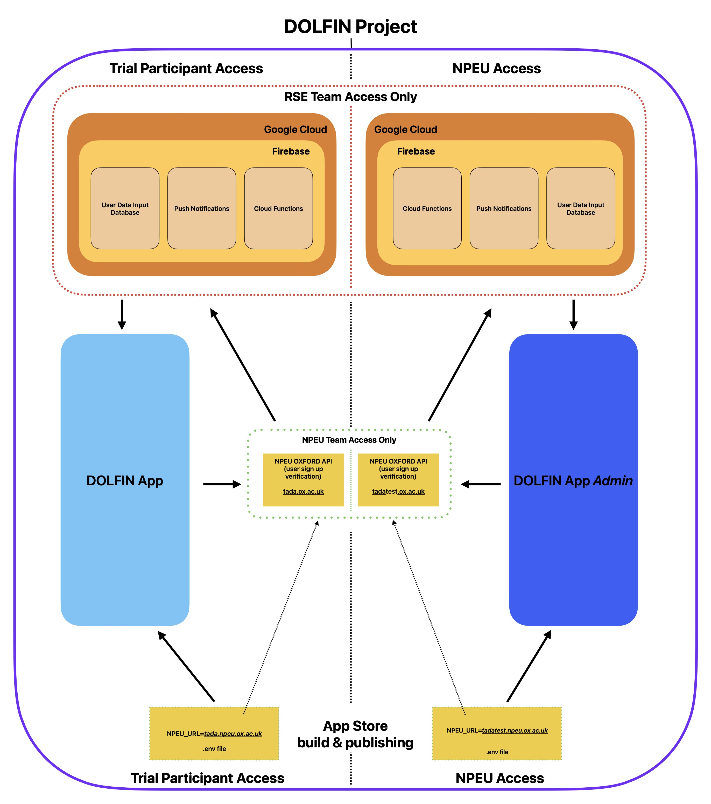

&nbsp;


# DOLFIN App
The Flutter-based app for the [DOLFIN Project](https://www.npeu.ox.ac.uk/dolfin).   

## About

Babies who are born very early, or who suffer poor blood supply or lack of oxygen to the brain before or around birth, are more likely to have problems with their brain development and child neurological development. This may affect how children think and learn, communicate, play, and interact with the world around them.

DOLFIN aims to answer the research question:

In babies who are born very early or who suffer poor blood supply or lack of oxygen to the brain before or around birth, does giving a nutritional supplement daily for a year improve long-term cognitive development?

## Nice to know
### The NPEU team have access to the Firebase database using a service account with a private key. This expires around the beginning of June annually. NPEU will give us  a new public key and we upload this to the service account through the Google console. 

### Project Team
**PI:** [Jeremy Parr](https://research.ncl.ac.uk/neurodisability/theteam/jeremyparr/)  
**RSEs:** 
* [Imre Draskovits](https://rse.ncldata.dev/team/imre-draskovits) [(@notimre)](https://github.com/notimre)
* [Mike Simpson](https://rse.ncldata.dev/team/mike-simpson) [(@mdsimpson42)](https://github.com/mdsimpson42) 
* [Kate Court](https://rse.ncldata.dev/team/kate-court) [(@KateCourt)](https://github.com/KateCourt) 
* [Mark Turner](https://rse.ncldata.dev/team/mark-turner) [(@markdturner)](https://github.com/markdturner)

## Project Structure

- [doflin-flutter](https://github.com/NewcastleRSE/dolfin-flutter/): Production repository (left side of the diagram)
- [dolfin-development](https://github.com/NewcastleRSE/dolfin-flutter-development): This repository. DOLFIN Admin app 'dev' branch, created for NPEU team (right side of the diagram)
- [dolfin-firebase](https://github.com/NewcastleRSE/dolfin-firebase): Includes Firebase Cloud Funcitons, Push Notifications and Database (top left of the diagram)
- [dolfin-firebase](https://github.com/NewcastleRSE/dolfin-firebase-development): Development Firebase Cloud Funcitons, Push Notifications and Database (top right of the diagram)

## Project Diagram



This repository contains both 'DOLFIN App' & 'DOLFIN App _Admin_'.  
The apps are identical with a key exception: _Admin_ app is built with the `.env` file pointing to the test API, while the DOLFIN App is the production ready version.  
The production ready version is not accessible to anyone besides the trial participants. This also excludes both DOLFIN and RSE teams. 

### Prerequisite Installs

The application uses [Flutter](https://flutter.dev/), which is written in [Dart](https://dart.dev); both developed and maintained by Google.

1. Install the following to get started on the project:

   * Flutter Framework (this also installs Dart for you, no need to do it explicitly): [Flutter MacOS](https://docs.flutter.dev/get-started/install/macos)
     * **IMPORTANT NOTES POST INSTALL:**
     * Must be downgraded to: **Flutter version 3.16.9 channel stable** 
     * **Do NOT run** `$ dart fix`
     * **Do NOT adjust** `pubspec.yaml` file! Unless you are keen on predicate logic
   * Xcode available on the [Mac App Store](https://apps.apple.com/us/app/xcode/id497799835?mt=12)
   * Android Studio available from the [Jetbrains Toolbox App](https://www.jetbrains.com/toolbox-app/)

   If you have an instalation of Flutter already, and installed this using homebrew, you may not be able to downgrade Flutter. If this is the case, remove your Flutter installation and install only the required version using these instructions for [installation](https://docs.flutter.dev/get-started/install/macos/mobile-ios?tab=download#add-flutter-to-your-path) and selecting the correct installation from [here](https://flutter-ko.dev/development/tools/sdk/releases?tab=macos).

2. Determine whether you need Ruby (version manager) on a Mac

   Developing on Mac requires you to install additional Ruby versions, which is not interfering with the system built-in one.  
   Recommended to check out [rbenv](https://github.com/rbenv/rbenv). A Ruby version manager.  `chruby` is also a good alternative.
   
   To determine if you need to install a Ruby Version manager, run:
   ```
       $ which ruby
   ```
   
   If it returns
   ```
       $ /usr/bin/ruby
   ```

   **You need to install a ruby version manager for MacOS to develop iOS apps.**

3. Refer to [rbenv repo](https://github.com/rbenv/rbenv) regarding installation.

4. Install Android Emulator
   
   #### Android requires Java 11. Anything newer will NOT work.

   You want to set up an Android emulator with API 34 or above running Android 14 or above. Do this within Android Studio (Step 1)  
   The project is 80:20 split focused in favour of Android, recommended to use Android Studio throughout the development in general.

5. Install iOS Simulators

   XCode 15 (or newer) will come pre-installed with the relevant up-to-date iOS simulators.
   No need to do anything else.

### Getting Started

Run the following command to confirm you installed everything above correctly:
```
    $ flutter doctor
```

If you see the following output, you are good to go:


### Project Setup to Firebase

1. Find the `.env` file on RSE Team OneDrive.
2. Clone the repository and place the `.env` file at root level of `dolfin-flutter/` directory

You need to configure the application on Android as well as on iOS with Firebase.   
If you skip this step, you will have a hard time debugging what is going on with no errors showing.

### Android

1. Download the relevant `google-services.json` file [from Firebase](https://console.firebase.google.com/project/dolfin-ec4ba/settings/general/android:uk.ac.ncl.rse.dolfin.admin).    
   To confirm you have the correct file, you will see `uk.ac.ncl.rse.dolfin.admin` under `package-name`.
2. Copy the file to `dolfin-flutter/android/app/` directory

Run the Android App for the first time
1. Open the Android Simulator manually (as flutter can't do it for you)
2. Install the flutter packages
    ```
        $ flutter pub get 
    ```
3. Run the project
    ```
        $ flutter run
    ```
4. Manually select the Android Simulator
5. Wait until it builds

#### iOS

1. Download the relevant `GoogleService-Info.plist` file [from Firebase](https://console.firebase.google.com/project/dolfin-ec4ba/settings/general/ios:uk.ac.ncl.rse.dolfin)
2. Copy the file to `dolfin-flutter/ios/` directory
3. Open XCode at `dolfin-flutter/ios/Runner.xcodeproj`
4. Right-click 'Runner'
5. Add Files to "Runner"
6. Select `GoogleService-Info.plist`
7. To confirm XCode recognises your file, you need to see it in the XCode file directory

If it doesn't work, [follow these steps](https://stackoverflow.com/a/73627958).

Run the iOS App for the first time
1. Open the iOS Simulator manually (as flutter can't do it for you)
2. Install the flutter packages
    ```
        $ flutter pub get
    ```
3. Install `Pods`
    ```
        $ cd ios 
    ```
    ```
        $ pod install 
    ```
4. Run the project
     ```
         $ flutter run
     ```
5. Manually select the iOS Simulator
6. Wait until it builds

### Building the iOS app to the App Store
```
flutter build ipa
```
Following a successful build, ask Imre to sort the rest out.

### Building the iOS app to the App Store [depricated]

```
# fastlane match development
# fastlane match appstore
# pod install
# bundle install
flutter build ipa
# bundle exec fastlane beta
```

### Regenerating the Icons (not needed unless there is an error)
The base icon image is specified in `pubspec.yaml` and the relevant dependencies should be installed automatically.
To regenerate the icons (for Android and iOS), edit the master image file and then use the following commands:

```
flutter pub get  
flutter pub run flutter_launcher_icons:main
```

## Roadmap

- [x] Initial Development  
- [x] Minimum viable product  
- [x] Feature-Complete
- [x] Late 2023 Update by Imre
- [x] Early 2024 Update by Imre

## Acknowledgements
This work was funded by a grant from the UK Research Councils, EPSRC grant ref. EP/L012345/1, “Example project title, please update”.
